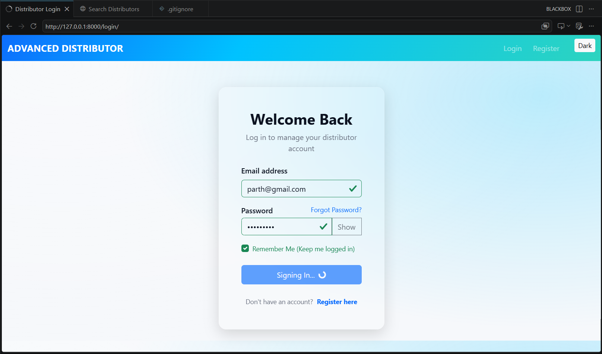
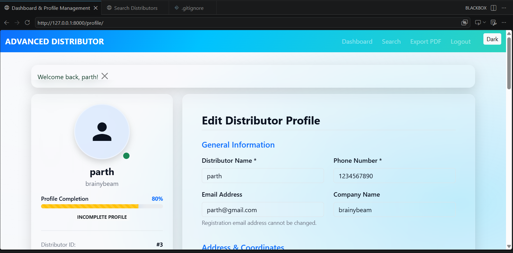
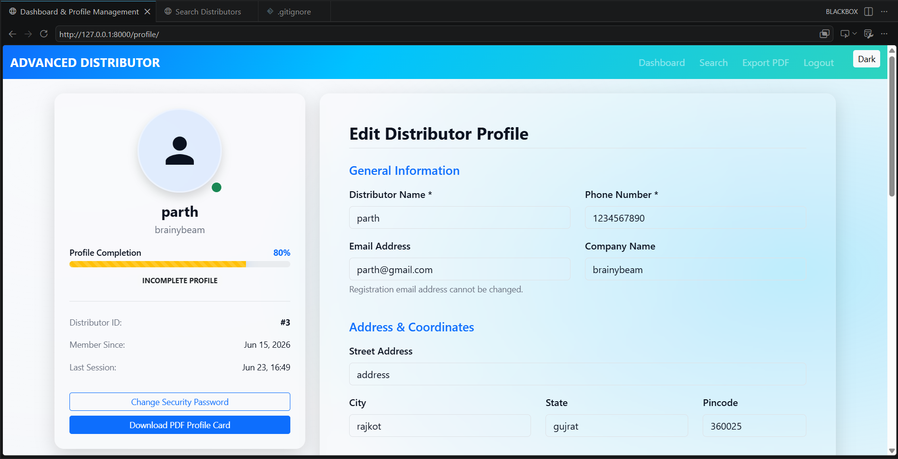

# Distributor Registration & Profile Management System

A Django-based web application that enables distributors to securely register, authenticate, and manage their profiles through a user-friendly interface. The system focuses on data integrity, secure authentication, and efficient profile management using a normalized MySQL database.

---

## 📌 Overview

The **Distributor Registration & Profile Management System** is designed to streamline distributor onboarding and profile management processes. It provides a secure platform for user registration, authentication, and profile updates while ensuring reliable data storage and retrieval.

### Key Highlights

* Secure user authentication and authorization
* Distributor profile creation and management
* MySQL database integration
* Responsive and user-friendly interface
* Server-side validation and security measures

---

## 🚀 Features

### 🔐 User Authentication

* Secure Login & Logout
* User Registration
* Password Validation
* Session Management

### 👤 Profile Management

* Create Distributor Profile
* Update Profile Information
* View Personal Details
* Edit Distributor Information

### 🗄️ Database Management

* MySQL Integration
* Normalized Database Design
* Secure Data Storage
* Efficient Data Retrieval

### 🛡️ Security Features

* Server-Side Validation
* Authentication Protection
* Form Validation
* Error Handling

### 🎨 User Interface

* Responsive Design
* Clean Dashboard
* Easy Navigation
* Mobile-Friendly Layout

---

## 🛠️ Technology Stack

### Backend

* Python
* Django Framework

### Frontend

* HTML5
* CSS3
* Bootstrap

### Database

* MySQL

### Development Tools

* Git
* GitHub
* VS Code

---

## 🏗️ System Architecture

```text
User
  │
  ▼
Frontend (HTML/CSS)
  │
  ▼
Django Views
  │
  ▼
Business Logic
  │
  ▼
MySQL Database
```

---

## 📂 Project Modules

### User Module

* Registration
* Authentication
* Authorization

### Distributor Module

* Profile Creation
* Profile Updates
* Data Management

### Admin Module

* User Monitoring
* Data Verification
* Database Administration

---

## 🎯 Project Objectives

* Simplify distributor registration processes.
* Provide secure profile management.
* Ensure data consistency and integrity.
* Demonstrate Django web application development.
* Implement secure authentication mechanisms.

---

## 📚 Learning Outcomes

Through this project, I gained practical experience in:

* Django Authentication System
* MySQL Database Integration
* CRUD Operations
* Responsive Web Development
* Database Normalization
* Backend Development with Python
* Secure Web Application Design

---

## 📸 Screenshots

```markdown





```

---

## ⚙️ Installation & Setup

### 1️⃣ Clone the Repository

```bash
git clone https://github.com/MrParth-the-coder/distributor-management-system.git
```

### 2️⃣ Navigate to Project Directory

```bash
cd distributor-management-system
```

### 3️⃣ Create Virtual Environment

```bash
python -m venv venv
```

### 4️⃣ Activate Virtual Environment

#### Windows

```bash
venv\Scripts\activate
```

#### Linux / macOS

```bash
source venv/bin/activate
```

### 5️⃣ Install Dependencies

```bash
pip install -r requirements.txt
```

### 6️⃣ Configure Database

Update your MySQL database credentials in:

```python
settings.py
```

Example:

```python
DATABASES = {
    'default': {
        'ENGINE': 'django.db.backends.mysql',
        'NAME': 'distributor_db',
        'USER': 'root',
        'PASSWORD': 'your_password',
        'HOST': 'localhost',
        'PORT': '3306',
    }
}
```

### 7️⃣ Apply Migrations

```bash
python manage.py makemigrations
python manage.py migrate
```

### 8️⃣ Create Superuser

```bash
python manage.py createsuperuser
```

### 9️⃣ Run Development Server

```bash
python manage.py runserver
```

Open:

```text
http://127.0.0.1:8000/
```

---

## 📈 Future Enhancements

* Email Verification
* Password Reset Functionality
* Distributor Analytics Dashboard
* Role-Based Access Control
* REST API Integration
* Export Reports in PDF/Excel Format

---

## 👨‍💻 Author

**Parth Gondaliya**

* Computer Engineering Student
* Robotics Lead – ADSC
* Cybersecurity Enthusiast
* Software Developer

### Connect With Me

* LinkedIn: https://linkedin.com/in/mrparth-gondaliya
* GitHub: https://github.com/MrParth-the-coder

---

## 📄 License

This project is developed for educational and learning purposes.
